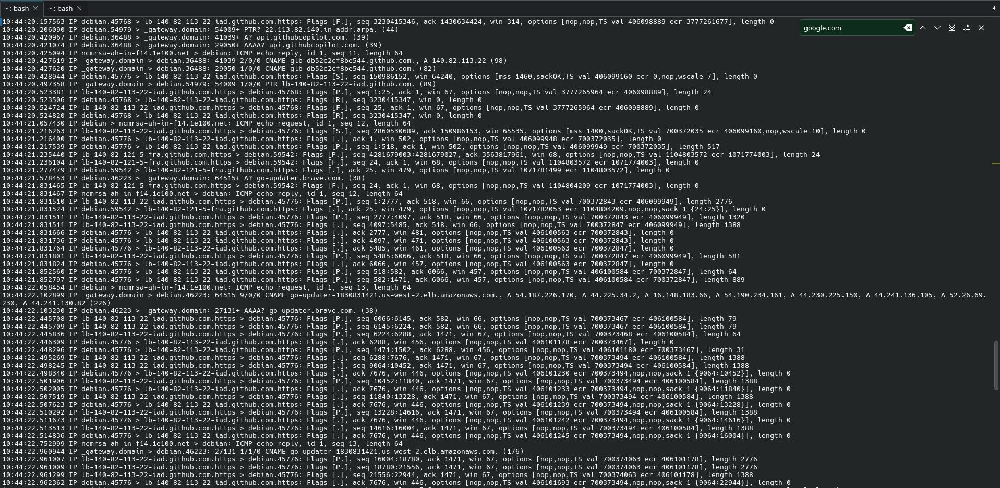
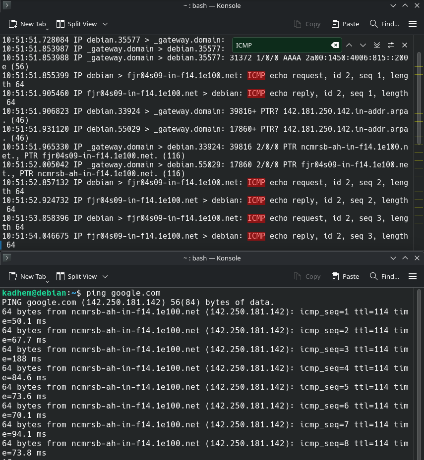
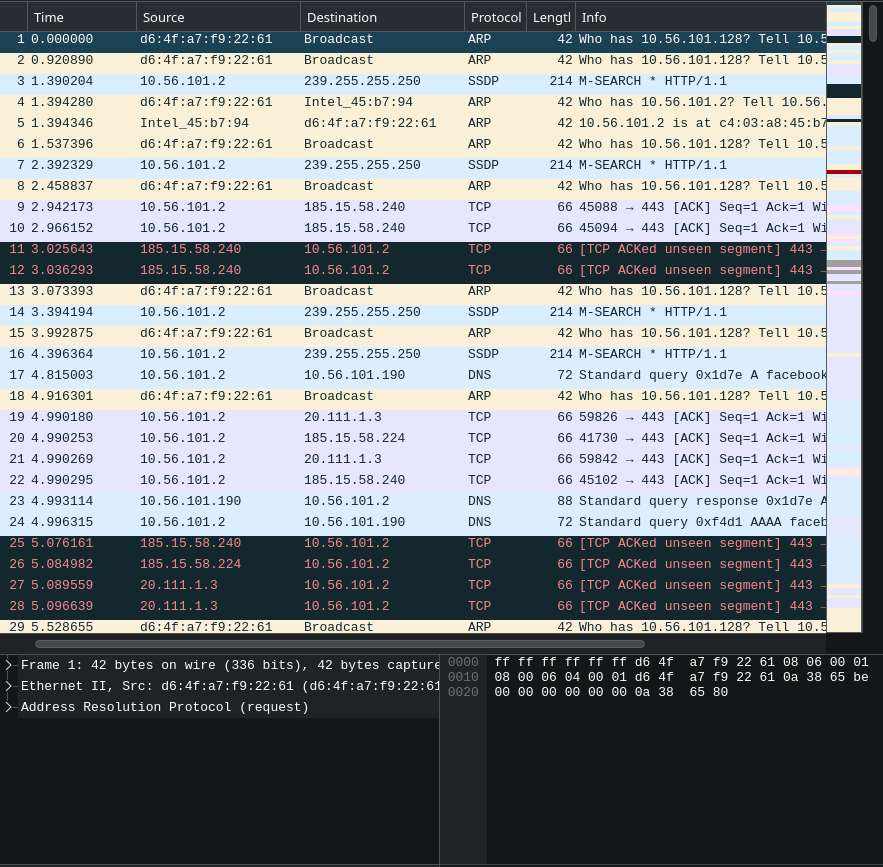
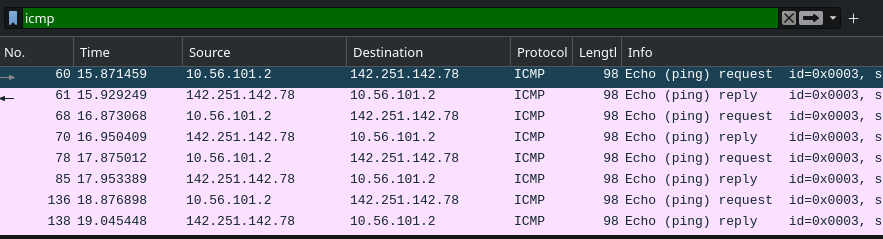
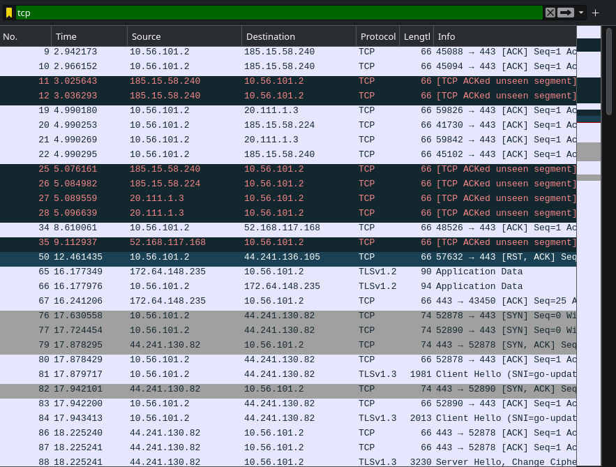
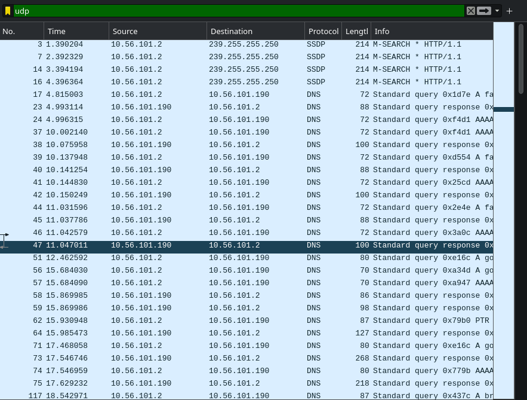
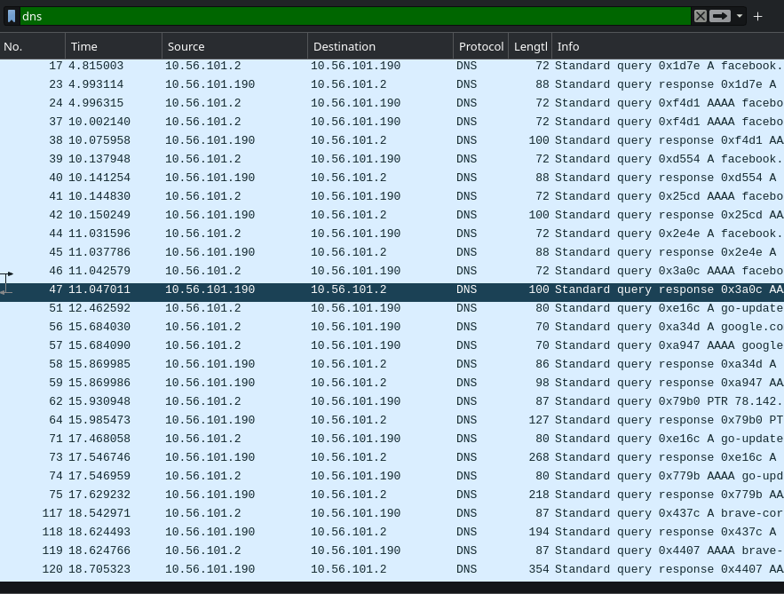
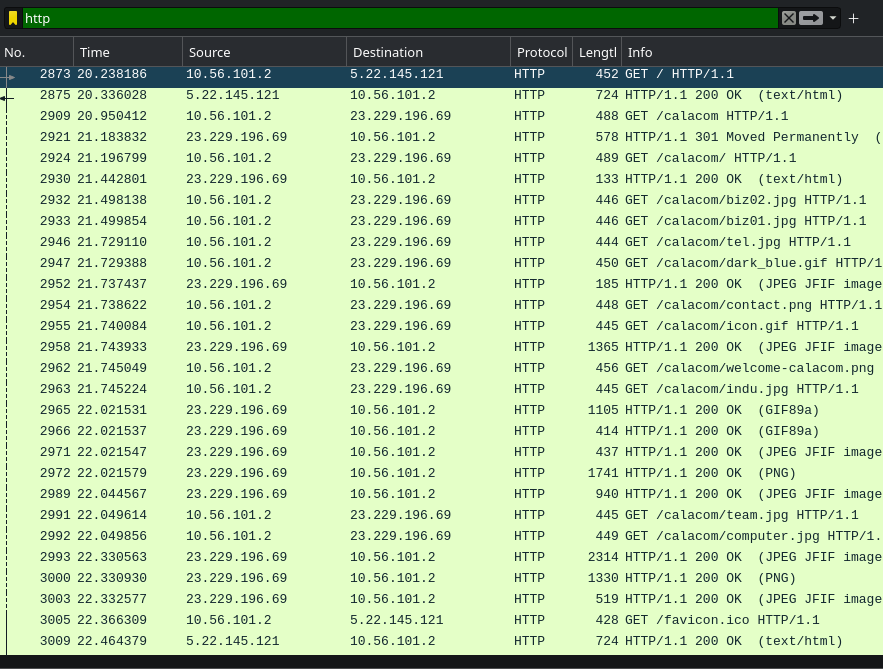

# Compte-rendu TP — Capture et analyse réseau

> **Outils utilisés :** Ce compte-rendu utilise tcpdump, Wireshark et effectue des tests (ping) vers Google.

---

## Sommaire

1. Préparatifs
2. Étape 1 — Capture simple (tcpdump)
3. Étape 2 — `ping` vers Google et capture ICMP
4. **Partie 2** — Réponses aux 2 questions
5. Étape 3 — Capture DNS filtrée + `nslookup`
6. Étape 4 — Captures Wireshark (non filtrée + 5 filtres protocolaires)
7. **Partie 3** — Réponses aux 2 questions
8. Conclusion et annexes (commandes utiles)

---

## Préparatifs

* Système : Ubuntu (version indiquée dans le TP).
* Installer les outils :

```bash
sudo apt update && sudo apt install tcpdump wireshark -y
```

* Vérifier l’interface à utiliser :

```bash
ip a
# ou
tcpdump -D
```

---

## Étape 1 — Capture simple en batch

**Objectif :** Lancer une capture simple sur l’interface `eth0` et observer le trafic en temps réel.

**Commande exécutée :**

```bash
sudo tcpdump -i eth0 -n
```

**Capture (placeholder) :**


**Description de la capture :**
Capture en temps réel affichant les paquets observés sur `eth0`. Le flag `-n` empêche la résolution DNS pour plus de rapidité et lisibilité.

---

## Étape 2 — `ping` vers Google et capture ICMP

**Objectif :** Lancer un ping vers Google et capturer les paquets ICMP générés.

**Commandes exécutées (deux terminaux) :**
Terminal 1 (capture) :

```bash
sudo tcpdump -i eth0 icmp -n -vv
```

Terminal 2 (ping) :

```bash
ping -c 4 google.com
```

**Capture (placeholder) :**


**Description :**
La capture montre les `ICMP echo request` (type 8) envoyés par la machine et les `ICMP echo reply` (type 0) reçus depuis l’adresse IP de destination (Google). On peut voir l’`id`, le `seq` et la longueur de la payload.

---

## Partie 2 — Réponses aux 2 questions

> *Les questions listées dans la "Partie 2" du TP sont traitées ci-dessous.*

**Question 1 — Quel protocole est utilisé par `ping` ?**
Réponse : `ping` utilise le protocole **ICMP** (Internet Control Message Protocol). Les messages `echo request` et `echo reply` correspondent respectivement aux types ICMP **8** et **0**.

**Question 2 — Comment identifier l’adresse IP source et destination dans la capture ?**
Réponse : Dans la sortie de `tcpdump` (ou dans Wireshark) chaque ligne commence par un horodatage puis la mention `IP source > destination`. Par exemple :

```
12:34:56.789 IP debian > fjr04s09-in-f14.1e100.net: ICMP echo request, id 0x3039, seq 1, length 64
```

Ici `debian` = **IP source** (ta machine), `fjr04s09-in-f14.1e100.net` = **IP destination**. Dans Wireshark, ces mêmes champs se lisent dans la couche IPv4 du paquet.

---

## Étape 3 — Capture DNS filtrée + `nslookup`

**Objectif :** Capturer uniquement le trafic DNS (port 53) pendant une résolution avec `nslookup`.

**Commande exécutée (capture) :**

```bash
sudo tcpdump -i eth0 port 53 -n -vv
```

**Commande exécutée (résolution) :**

```bash
nslookup example.com
```

**Capture (placeholder) :**


**Description :**
La capture affiche les requêtes DNS (généralement UDP port source éphémère → dst port 53) et les réponses contenant les enregistrements A/AAAA. Note : si le serveur DNS utilise TCP (rare pour petites résolutions), la capture le montrera aussi.

---

## Étape 4 — Captures avec **Wireshark** (non filtrée + filtres protocolaires)

**Objectif :** Ouvrir le pcap dans Wireshark et montrer : 1) capture non filtrée et 2) six vues filtrées par protocole (6 screenshots).

> Ouvrir le fichier pcap :

```bash
wireshark capture.pcap &
```

### Capture Wireshark — non filtrée

**Screenshot (placeholder) :**


**Description :**
Vue générale de tous les paquets capturés (sans filtre d’affichage). Utile pour avoir un aperçu et localiser événements intéressants (ARP, ICMP, DNS, TCP...).

---

### Filtres protocolaires (6 captures)

Pour chaque filtre ci-dessous, indique la commande (display filter) utilisée dans la barre de Wireshark.

1. **ICMP**

   * **Filtre Wireshark :** `icmp`
   * **Screenshot (placeholder) :**
     
   * **Description :** Affiche uniquement paquets ICMP (echo request / reply).

2. **TCP**

   * **Filtre Wireshark :** `tcp`
   * **Screenshot (placeholder) :**
     
   * **Description :** Montre les flux TCP; utile pour analyser handshakes, flags, retransmissions.

3. **UDP**

   * **Filtre Wireshark :** `udp`
   * **Screenshot (placeholder) :**
     
   * **Description :** Filtre pour le trafic sans connexion (ex. DNS, DHCP, certains flux applicatifs).

4. **DNS**

   * **Filtre Wireshark :** `dns`
   * **Screenshot (placeholder) :**
     
   * **Description :** Affiche requêtes et réponses DNS décodées (types, classes, enregistrements).

5. **HTTP**

   * **Filtre Wireshark :** `http`
   * **Screenshot (placeholder) :**
     
   * **Description :** Montre requêtes et réponses HTTP (GET, POST, en-têtes). Si le trafic est chiffré (HTTPS), il n’apparaîtra pas ici.

---

## Partie 3 — Réponses aux 2 questions

> *Ici on répond aux deux questions typiques de la "Partie 3" du TP (analyse de paquets).*

**Question 1 — Quelle est la différence entre filtre de capture et filtre d’affichage ?**
Réponse :

* **Filtre de capture (BPF)** : s’applique **pendant** la capture (au niveau libpcap) — il limite ce qui est enregistré dans le fichier pcap. Exemple : `tcpdump -i eth0 port 53` capture uniquement le port 53. Avantage = réduit la taille du pcap et la charge CPU/I/O.
* **Filtre d’affichage (Wireshark display filter)** : s’applique **après** la capture, dans l’interface de lecture. Exemple : `dns` ou `tcp.port == 80`. Avantage = plus riche et plus expressif ; on peut changer à volonté sans perdre de données (mais le pcap contient tous les paquets).

**Question 2 — Analyse d’un paquet ICMP et d’un paquet TCP (champs importants) :**
Réponse synthétique :

* **Paquet ICMP (ex. ping)** :

  * Champs IP : `src`, `dst`, `TTL`, `Checksum IP`.
  * Champs ICMP : `Type` (8=request, 0=reply), `Code` (souvent 0), `Checksum`, `Identifier`, `Sequence number`, `Payload` (données envoyées).
  * Interprétation : identifier/seq permettent d’appariement request↔reply ; TTL indique nombre de sauts restants.

* **Paquet TCP (ex. handshake 3-way)** :

  * Champs IP : `src`, `dst`, `TTL`.
  * Champs TCP : `src port`, `dst port`, `seq`, `ack`, `flags` (SYN, ACK, FIN, RST, PSH, URG), `window`, `checksum`, `options` (MSS, SACK, TS, wscale), `payload length`.
  * Analyse typique :

    1. SYN (client → serveur) : initie connexion, contient seq initial et options.
    2. SYN-ACK (serveur → client) : ack = seq_client+1, contient son seq serveur.
    3. ACK (client → serveur) : ack = seq_server+1 — connexion établie.
  * Signes d’anomalie : retransmissions (`tcp.analysis.retransmission`), RST inattendu, forte latence entre seq/ack.

---

## Conclusion

Ce document fournit un compte-rendu structuré : captures `tcpdump`, résolution DNS avec `nslookup`, et analyses avec Wireshark (non filtré + 5 filtres).

---

## Annexes — Commandes utiles (résumé)

```bash
# Lister interfaces
tcpdump -D

# Capture simple
sudo tcpdump -i eth0 -n

# Capture filtered (DNS)
sudo tcpdump -i eth0 port 53 -n -w dns_capture.pcap

# Capture ICMP
sudo tcpdump -i eth0 icmp -n -vv -w icmp_capture.pcap

# Lire pcap
tcpdump -r capture.pcap -n -vv

# Ouvrir dans Wireshark
wireshark capture.pcap &

# Filtre Wireshark exemples (display filters)
# ICMP
icmp
# DNS
dns
# TCP SYN
tcp.flags.syn == 1
# HTTP
http
```